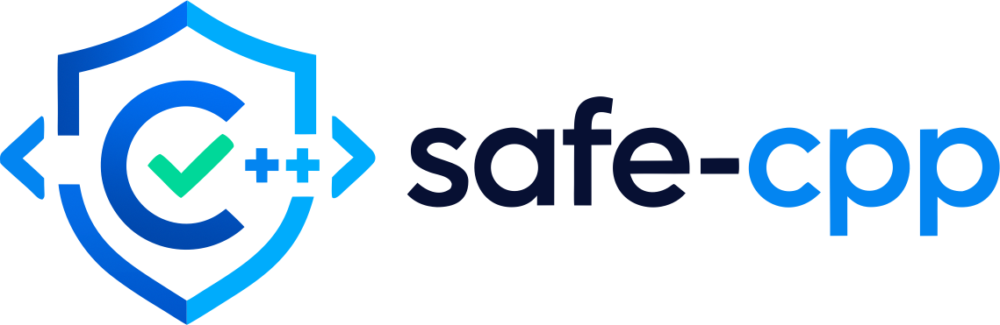

<p align="center">
    <a href="https://github.com/paulocoutinhox/safe-cpp" target="_blank" rel="noopener noreferrer">
        
    </a>
</p>
<p align="center">
  <a href="https://github.com/paulocoutinhox/safe-cpp/actions/workflows/test.yml"></a>
  <a href="https://codecov.io/gh/paulocoutinhox/safe-cpp"></a>
  <a href="https://github.com/paulocoutinhox/safe-cpp/blob/main/LICENSE.md"></a>
  <a href="https://en.cppreference.com/w/cpp/20.html"></a>
</p>
<p align="center">
Safety-oriented building blocks for modern C++ that follow approaches from languages with newer safety mechanics and features where standard C++ can provide them cleanly.
</p>

<br>

## 🚀 Project

This library is a C++20+ project for making unsafe states harder to express without replacing the C++ language, ABI, toolchain or ecosystem.

It combines ownership-oriented types, non-null pointers, checked indexing, checked arithmetic, explicit allocators, scoped cleanup, structured errors, runtime borrow enforcement and concurrency wrappers behind small focused modules. C++23 automatically uses `std::expected` for `Result` when the standard library provides it while C++20 uses the library backend with the same public API.

The library does not claim to turn standard C++ into a language with compiler-enforced memory safety. Compile-time lifetime proofs, a language-level borrow checker and a mandatory `unsafe` boundary require compiler support. The library focuses on the strongest guarantees that can be implemented professionally in standard C++20 and newer.

## ✨ Features

- [x] C++20 minimum with C++23 feature detection
- [x] `Result<T, E>` with `std::expected` on supported C++23 standard libraries
- [x] `Option<T>` for explicit optional state
- [x] `Box<T>`, `Arc<T>`, `Weak<T>` and `NonNull<T>` ownership primitives
- [x] `BorrowCell<T>`, `Ref<T>` and `Mut<T>` with runtime shared versus mutable borrow enforcement
- [x] Checked `Vector`, `Array`, `Slice` and `String` indexing
- [x] Checked integral arithmetic with overflow and division validation
- [x] `defer { ... };` and `makeDefer()` scope finalization
- [x] Explicit heap and arena allocators with typed RAII allocations
- [x] `Mutex<T>` that rejects direct reference and pointer callback results
- [x] Typed multi-producer channels with explicit close behavior
- [x] Structured safety violations instead of silent undefined behavior in library checks
- [x] CMake package installation and `safe-cpp::safe-cpp` target
- [x] GoogleTest and GoogleMock test suite through CTest
- [x] GitHub Actions on Ubuntu, macOS and Windows with GCC, Clang and MSVC across C++20 and C++23

## 📦 Install

Add the repository with CMake `FetchContent`:

```cmake
include(FetchContent)

FetchContent_Declare(
    safe_cpp
    GIT_REPOSITORY https://github.com/paulocoutinhox/safe-cpp.git
    GIT_TAG main
)

FetchContent_MakeAvailable(safe_cpp)

target_link_libraries(my_target PRIVATE safe-cpp::safe-cpp)
```

Or install it first:

```bash
cmake -S . -B build -DCMAKE_BUILD_TYPE=Release
cmake --build build
cmake --install build --prefix ./install
```

Then consume it from another CMake project:

```cmake
find_package(safe-cpp CONFIG REQUIRED)
target_link_libraries(my_target PRIVATE safe-cpp::safe-cpp)
```

## 💡 How to use

```cpp
#include <safe_cpp/safe_cpp.hpp>

#include <iostream>
#include <string>

safe::result::Result<std::string, std::string> loadName(bool available)
{
    if (!available)
    {
        return safe::result::Result<std::string, std::string>::err("Name is unavailable");
    }

    return safe::result::Result<std::string, std::string>::ok("world");
}

int main()
{
    auto allocator = safe::allocation::HeapAllocator::create();
    auto number = allocator->make<int>(42);

    defer
    {
        std::cout << "Scope finished\n";
    };

    auto name = loadName(true);
    if (!name)
    {
        return 1;
    }

    std::cout << "Hello, " << name.value() << ": " << *number << '\n';
    return 0;
}
```

## 🧱 The safety model

| Area | safe-cpp approach |
| --- | --- |
| Ownership | `Box`, `Arc`, `Weak`, typed allocator ownership |
| Nullability | `NonNull` and `Option` |
| Errors | `Result<T, E>` |
| Scope cleanup | `defer` and RAII |
| Borrowing | Runtime `BorrowCell`, `Ref` and `Mut` rules |
| Bounds | Checked container and slice access |
| Arithmetic | Checked integral operations |
| Concurrency | Encapsulated `Mutex<T>` and channels |
| Allocation | Explicit heap and arena allocators |
| Violations | Deterministic typed exceptions from safe-cpp checks |

## 📚 Documentation

- [Getting started](docs/getting-started.md)
- [Result](docs/result.md)
- [Option](docs/option.md)
- [Memory](docs/memory.md)
- [Borrowing](docs/borrow.md)
- [Bounds](docs/bounds.md)
- [Arithmetic](docs/arithmetic.md)
- [Defer](docs/defer.md)
- [Allocation](docs/allocation.md)
- [Concurrency](docs/concurrency.md)
- [Diagnostics](docs/diagnostics.md)
- [C++ version behavior](docs/cpp-versions.md)
- [Limitations](docs/limitations.md)
- [Contribution](docs/contribution.md)

## ☕ Buy me a coffee

Support the continuous development of this project.

<a href='https://ko-fi.com/A0A412XEV' target='_blank'></a>

## 📄 License

[MIT](http://opensource.org/licenses/MIT)

Copyright (c) 2026, Paulo Coutinho
